# DAX 40 ESG-Datenlandschaft
## Umfassende Analyse der Verfügbarkeit von Nachhaltigkeitsdaten über die Dataland API

---

**Analysedatum:** 16. November 2025  
**Berichtsversion:** 1.0  
**Datenquelle:** Dataland API  
**Abdeckung:** DAX 40 Unternehmen  

---

## Zusammenfassung

### 🎯 Haupterkenntnisse

Diese umfassende Analyse untersucht die Verfügbarkeit und Verteilung von Umwelt-, Sozial- und Governance-Daten (ESG) für DAX 40-Unternehmen über die Dataland API. Die Analyse offenbart bedeutende Einblicke in Datenabdeckung, Qualität und Lücken über Deutschlands führenden Aktienindex hinweg.

#### Hauptstatistiken

| Kennzahl | Wert | Anmerkungen |
|----------|------|-------------|
| **Analysierte DAX-Unternehmen** | 38 | Von 40 insgesamt |
| **Gesamt Unternehmens-IDs** | 92 | Ø 2.42 IDs pro Unternehmen |
| **Gesamt Datendimensionen** | 12,419 | Über alle Unternehmen |
| **Eindeutige Indikatoren** | 338 | Unterschiedliche erfasste Datenpunkte |
| **Unternehmen mit Daten** | 33 | 35.9% aller IDs |
| **Unternehmen ohne Daten** | 59 | 64.1% aller IDs |
| **Ø Dimensionen/Unternehmen** | 135.0 | Bei Unternehmen mit Daten |

#### 🔴 Kritische Erkenntnisse

1. **Datenverfügbarkeitslücke**: Während 33 Unternehmens-IDs ESG-Daten verfügbar haben, haben **59 Unternehmens-IDs (64%) null Dimensionen**, was entweder auf Tochtergesellschaften oder Datenerfassungslücken hindeutet.

2. **Keine universellen Indikatoren**: Es gibt **0 Indikatoren**, die über alle Unternehmen verfügbar sind, was auf fragmentierte Berichtsstandards hinweist.

3. **Begrenzte hohe Abdeckung**: Nur **0 Indikatoren** erreichen ≥80% Abdeckung über Unternehmen hinweg.

4. **Mehrere IDs pro Unternehmen**: DAX-Unternehmen haben durchschnittlich 2.42 Unternehmens-IDs in Dataland, was komplexe Unternehmensstrukturen mit Muttergesellschaften, Tochtergesellschaften und Fonds widerspiegelt.

---

## 1. Methodik

### 1.1 Ansatz zur Datenerhebung

Diese Analyse nutzt die Dataland API, um systematisch die Verfügbarkeit von ESG-Daten über DAX 40-Unternehmen zu erfassen und zu analysieren. Die Methodik besteht aus:

**Schritt 1: Unternehmensidentifizierung**
- Begonnen mit offizieller DAX 40-Unternehmensliste (38 Unternehmen im Datensatz enthalten)
- Verwendung der Dataland-Unternehmenssuche-API (`/api/companies/names`) zur Identifizierung aller zugehörigen Unternehmens-IDs
- Jedes DAX-Unternehmen kann mehrere IDs haben, die Muttergesellschaften, Tochtergesellschaften und verbundene Unternehmen repräsentieren

**Schritt 2: Dimensionsextraktion**
- Für jede Unternehmens-ID wurden verfügbare Datendimensionen über `/api/metadata/available-data-dimensions` abgefragt
- Gefiltert nach Berichtszeiträumen: 2020 - 2025
- Extrahierte Dimensionsmetadaten einschließlich Indikatortypen, Berichtszeiträumen und Datenpunkt-IDs

**Schritt 3: Datenstrukturierung**
- Normalisiert und kategorisiert alle 12,419 Dimensionen
- Klassifizierte Indikatoren nach:
  - **Datentyp** (Dezimal, Enum, Datum, etc.)
  - **ESG-Kategorie** (Umwelt, Soziales, Governance)
  - **Framework** (SFDR, PCAF, etc.)

**Schritt 4: Analyse**
- Häufigkeitsanalyse: Welche Indikatoren erscheinen am häufigsten?
- Abdeckungsanalyse: Welche Indikatoren sind über Unternehmen hinweg verfügbar?
- Lückenanalyse: Welchen Unternehmen fehlen Daten?
- Querschnittsanalyse: Muster und Korrelationen

### 1.2 Umfang und Einschränkungen

**Berichtszeitraum:** 2020 - 2025

**Einschränkungen:**
- Analyse fokussiert auf *Verfügbarkeit* von Daten, nicht auf Qualität oder Genauigkeit
- Mehrere Unternehmens-IDs pro DAX-Entität können Muster aufblähen oder verschleiern
- Null-Dimensions-IDs können legitime Tochtergesellschaften ohne separate Berichterstattung darstellen
- API-Zugriff beschränkt auf öffentlich verfügbare/erlaubte Daten

---

## 2. Analyse der Unternehmensabdeckung

### 2.1 Verteilung der Unternehmens-IDs

Die 38 analysierten DAX-Unternehmen werden **92 eindeutigen Unternehmens-IDs** im Dataland-System zugeordnet, durchschnittlich **2.42 IDs pro DAX-Unternehmen**.

Diese Vielzahl spiegelt wider:
- Muttergesellschaft + Tochtergesellschaftsbeziehungen
- Investmentfonds und Zweckgesellschaften
- Internationale Niederlassungen und regionale Einheiten
- Separate juristische Personen innerhalb von Unternehmensgruppen

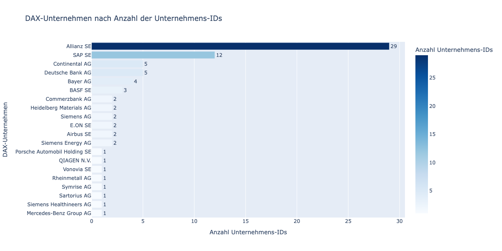

### 2.2 Datenverfügbarkeit nach Unternehmen

#### Top 20 Unternehmen nach Datendimensionen

| dax_name                             | company_name                           |   num_dimensions |
|:-------------------------------------|:---------------------------------------|-----------------:|
| Daimler Truck Holding AG             | Daimler Truck Holding AG               |              452 |
| E.ON SE                              | E.ON SE                                |              447 |
| Deutsche Börse AG                    | Deutsche Börse Aktiengesellschaft      |              429 |
| BASF SE                              | BASF SE                                |              428 |
| Airbus SE                            | AIRBUS SE                              |              425 |
| Siemens Energy AG                    | Siemens Energy AG                      |              423 |
| Siemens AG                           | Siemens Aktiengesellschaft             |              421 |
| MTU Aero Engines AG                  | MTU Aero Engines AG                    |              419 |
| Vonovia SE                           | Vonovia SE                             |              419 |
| Brenntag SE                          | BRENNTAG SE                            |              417 |
| Deutsche Telekom AG                  | DEUTSCHE TELEKOM AG                    |              416 |
| Bayer AG                             | Bayer Aktiengesellschaft               |              415 |
| Infineon Technologies AG             | Infineon Technologies AG               |              415 |
| Fresenius Medical Care AG & Co. KGaA | Fresenius Medical Care AG              |              414 |
| Fresenius SE & Co. KGaA              | Fresenius SE & Co. KGaA                |              413 |
| Symrise AG                           | Symrise AG                             |              413 |
| Merck KGaA                           | MERCK Kommanditgesellschaft auf Aktien |              404 |
| Sartorius AG                         | Sartorius Aktiengesellschaft           |              403 |
| Heidelberg Materials AG              | Heidelberg Materials AG                |              391 |
| Rheinmetall AG                       | Rheinmetall Aktiengesellschaft         |              391 |

**Beobachtungen:**
- Top-Unternehmen hat **452 Dimensionen**
- Top-Performer gruppieren sich um **350-450 Dimensionen**
- Starke Vertretung aus Industrie-, Automobil- und Energiesektoren

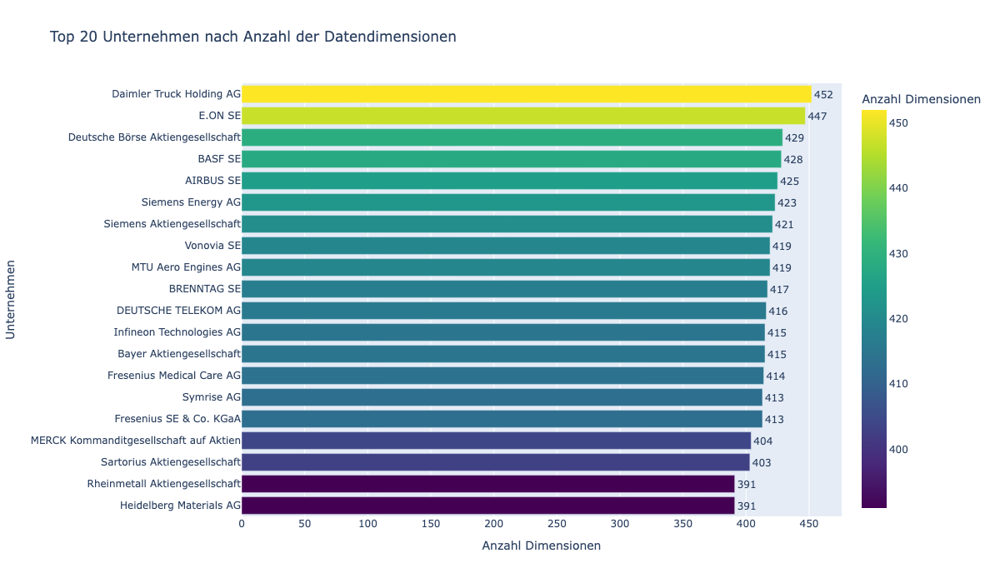

#### Datenvollständigkeits-Scores

Vollständigkeit wird als Prozentsatz der maximal verfügbaren Dimensionen (452) berechnet:

| Vollständigkeitsstufe | Anzahl Unternehmen | Prozentsatz |
|-----------------------|--------------------|-------------|
| 90-100% (Hervorragend) | 16 | 17.4% |
| 70-89% (Gut) | 11 | 12.0% |
| 50-69% (Ausreichend) | 3 | 3.3% |
| 1-49% (Begrenzt) | 3 | 3.3% |
| 0% (Keine Daten) | 59 | 64.1% |

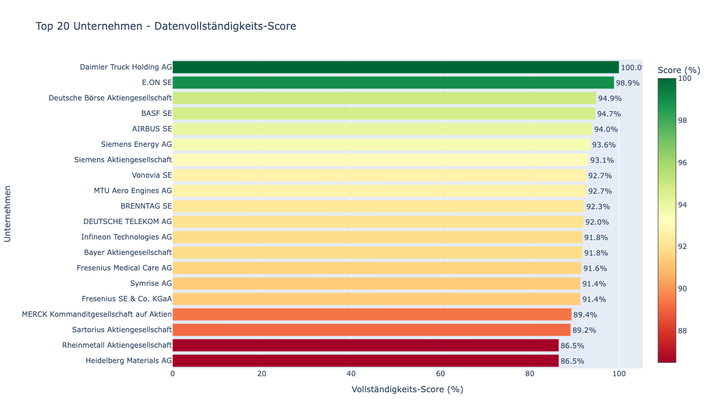

### 2.3 Unternehmen ohne Dimensionen

**59 Unternehmens-IDs (64.1%)** haben null Datendimensionen. Dies sind hauptsächlich:
- Tochtergesellschaften und Zweckgesellschaften
- Investmentfonds und Finanzinstrumente
- Regionale Niederlassungen ohne separate Berichterstattung
- Entitäten möglicherweise außerhalb des aktuellen Datenerfassungsumfangs

**Top DAX-Unternehmen mit den meisten Null-Daten-IDs:**

| dax_name         |   num_zero_ids |
|:-----------------|---------------:|
| Allianz SE       |             28 |
| SAP SE           |             11 |
| Continental AG   |              4 |
| Deutsche Bank AG |              4 |
| Bayer AG         |              3 |
| BASF SE          |              2 |
| Airbus SE        |              1 |
| Beiersdorf AG    |              1 |
| Commerzbank AG   |              1 |
| E.ON SE          |              1 |

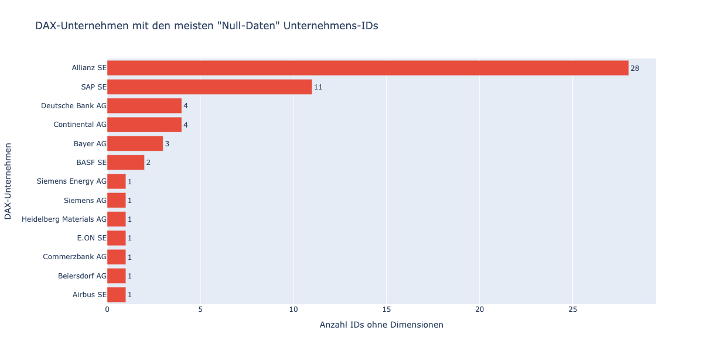

---

## 3. Indikatoranalyse

### 3.1 Verteilung der Indikatorhäufigkeit

Von den **338 eindeutigen Indikatoren** variiert die Häufigkeit dramatisch:

#### Top 30 häufigste Indikatoren

| indicator                                                                   |   count |   percentage |
|:----------------------------------------------------------------------------|--------:|-------------:|
| plainEnumFiscalYearDeviation                                                |      66 |     0.531444 |
| extendedEnumYesNoControversialWeaponsExposure                               |      66 |     0.531444 |
| plainDateSfdrDataDate                                                       |      66 |     0.531444 |
| sfdr                                                                        |      66 |     0.531444 |
| plainDateFiscalYearEnd                                                      |      66 |     0.531444 |
| pcaf                                                                        |      66 |     0.531444 |
| extendedEnumYesNoHumanRightsDueDiligence                                    |      65 |     0.523392 |
| extendedEnumYesNoIloCoreLabourStandards                                     |      65 |     0.523392 |
| extendedEnumYesNoUnGlobalCompactPrinciplesCompliancePolicy                  |      65 |     0.523392 |
| extendedEnumYesNoCorruptionLegalProceedings                                 |      64 |     0.515339 |
| extendedEnumYesNoEnvironmentalPolicy                                        |      64 |     0.515339 |
| extendedEnumYesNoCarbonReductionInitiatives                                 |      64 |     0.515339 |
| extendedEnumYesNoHumanRightsDueDiligencePolicy                              |      64 |     0.515339 |
| extendedEnumYesNoWhistleblowerProtectionPolicy                              |      64 |     0.515339 |
| extendedEnumYesNoWaterManagementPolicy                                      |      64 |     0.515339 |
| extendedDecimalScope1GhgEmissionsInTonnes                                   |      64 |     0.515339 |
| extendedEnumYesNoManufactureOfAgrochemicalPesticidesProducts                |      64 |     0.515339 |
| extendedEnumYesNoPrimaryForestAndWoodedLandOfNativeSpeciesExposure          |      64 |     0.515339 |
| extendedEnumYesNoTransparencyDisclosurePolicy                               |      64 |     0.515339 |
| extendedEnumYesNoReportedForcedOrCompulsoryLabourIncidents                  |      64 |     0.515339 |
| extendedEnumYesNoPolicyAgainstChildLabour                                   |      64 |     0.515339 |
| extendedEnumYesNoDeforestationPolicy                                        |      64 |     0.515339 |
| extendedEnumYesNoPolicyAgainstDiscriminationInTheWorkplace                  |      64 |     0.515339 |
| extendedEnumYesNoIso14001Certificate                                        |      64 |     0.515339 |
| extendedEnumYesNoPolicyAgainstBriberyAndCorruption                          |      64 |     0.515339 |
| extendedEnumYesNoFairCompetitionPolicy                                      |      64 |     0.515339 |
| extendedEnumYesNoOecdGuidelinesForMultinationalEnterprisesGrievanceHandling |      64 |     0.515339 |
| extendedEnumYesNoGrievanceHandlingMechanism                                 |      64 |     0.515339 |
| extendedEnumYesNoHumanRightsLegalProceedings                                |      64 |     0.515339 |
| extendedEnumYesNoTechnologiesExpertiseTransferPolicy                        |      64 |     0.515339 |

**Hauptbeobachtungen:**
- Top-Indikatoren erscheinen häufig über Dimensionen hinweg
- Framework-Identifikatoren (SFDR, PCAF) und Metadatenfelder (Daten, Geschäftsjahr) dominieren
- Ja/Nein-Policy-Indikatoren sind hochfrequent
- Langer Schwanz: viele Indikatoren erscheinen sehr selten

**Interpretation**: Die Bedeutung hinter den jeweiligen Indikatoren sind [dieser Analyse](Top_30_ESG_Indikatoren.md) zu entnehmen.

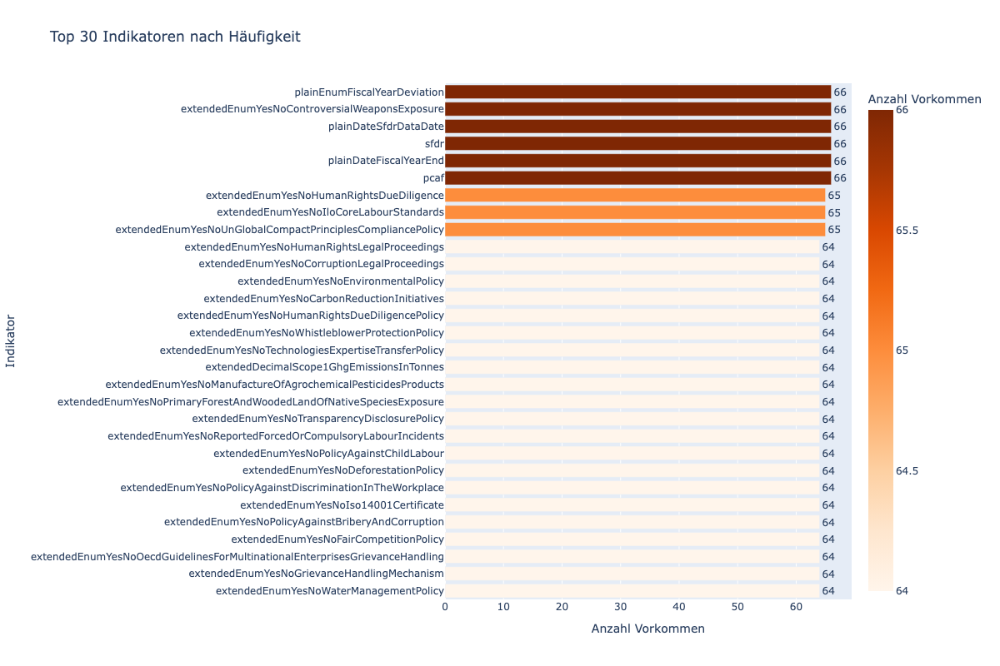

### 3.2 Aufschlüsselung nach Indikatortyp

Indikatoren kategorisiert nach Datentyp:

| category               |   count |
|:-----------------------|--------:|
| Numeric (Decimal)      |    6799 |
| Extended Enum (Yes/No) |    3164 |
| Other                  |    2126 |
| Framework Type         |     132 |
| Date Fields            |     132 |
| Basic Enum             |      66 |

**Analyse:**
- **Extended Enum (Ja/Nein)** Indikatoren dominieren, was policy-orientierte ESG-Berichterstattung widerspiegelt
- **Numeric (Dezimal)** Indikatoren liefern quantitative ESG-Metriken
- Framework-Typ-Indikatoren (SFDR, PCAF) dienen als kategorische Marker

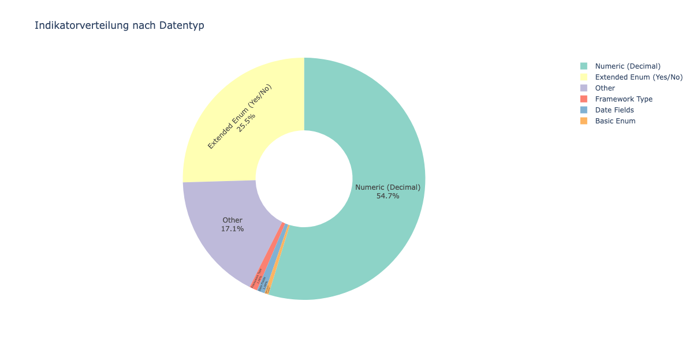

### 3.3 ESG-Kategorieverteilung

Kategorisierung der Indikatoren nach ESG-Thema:

| esg_category   |   count |
|:---------------|--------:|
| Environmental  |    5039 |
| Framework/Meta |     456 |
| Governance     |    1840 |
| Other          |    4082 |
| Social         |    1002 |

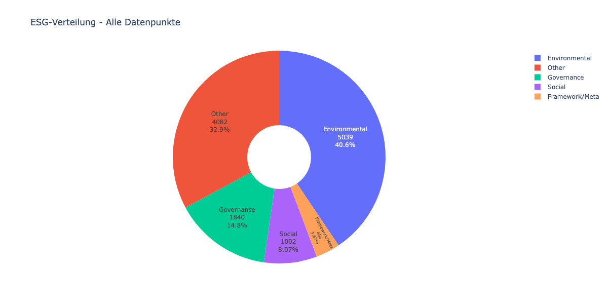

### 3.4 Abdeckungsanalyse

#### Indikatoren mit hoher Abdeckung

Die **maximale Abdeckung** beträgt ungefähr **35.9%** (33 von 92 Unternehmen).

#### Top 20 Indikatoren nach Abdeckung

| indicator                                                                   |   num_companies |   coverage_percentage |
|:----------------------------------------------------------------------------|----------------:|----------------------:|
| sfdr                                                                        |              33 |               35.8696 |
| extendedEnumYesNoControversialWeaponsExposure                               |              33 |               35.8696 |
| extendedEnumYesNoDeforestationPolicy                                        |              33 |               35.8696 |
| extendedEnumYesNoEnvironmentalPolicy                                        |              33 |               35.8696 |
| extendedEnumYesNoFairCompetitionPolicy                                      |              33 |               35.8696 |
| extendedEnumYesNoFossilFuelSectorExposure                                   |              33 |               35.8696 |
| extendedEnumYesNoGrievanceHandlingMechanism                                 |              33 |               35.8696 |
| extendedEnumYesNoHighWaterStressAreaExposure                                |              33 |               35.8696 |
| extendedEnumYesNoHighlyBiodiverseGrasslandExposure                          |              33 |               35.8696 |
| extendedEnumYesNoHumanRightsDueDiligence                                    |              33 |               35.8696 |
| extendedEnumYesNoHumanRightsDueDiligencePolicy                              |              33 |               35.8696 |
| extendedEnumYesNoHumanRightsLegalProceedings                                |              33 |               35.8696 |
| extendedEnumYesNoHumanRightsPolicy                                          |              33 |               35.8696 |
| extendedEnumYesNoIloCoreLabourStandards                                     |              33 |               35.8696 |
| extendedDecimalNonRenewableEnergyConsumptionInGWh                           |              33 |               35.8696 |
| extendedEnumYesNoIso14001Certificate                                        |              33 |               35.8696 |
| extendedEnumYesNoLandDegradationDesertificationSoilSealingExposure          |              33 |               35.8696 |
| extendedEnumYesNoCorruptionLegalProceedings                                 |              33 |               35.8696 |
| extendedEnumYesNoCarbonReductionInitiatives                                 |              33 |               35.8696 |
| extendedEnumYesNoOecdGuidelinesForMultinationalEnterprisesGrievanceHandling |              33 |               35.8696 |

**Beobachtungen:**
- Selbst die häufigsten Indikatoren erreichen nur ~36% Abdeckung
- Abdeckung fällt schnell über Top-Indikatoren hinaus ab
- Deutet entweder auf:
  - Heterogene Berichtspraktiken
  - Unterschiedliche Framework-Adoptionsraten
  - Unvollständige Datenerfassung

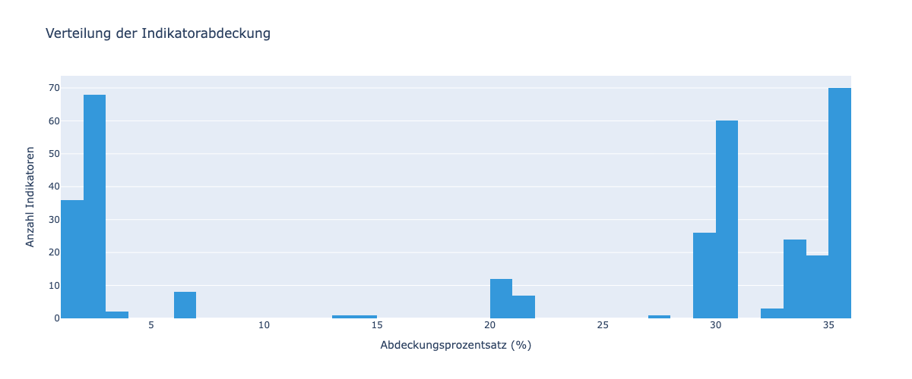

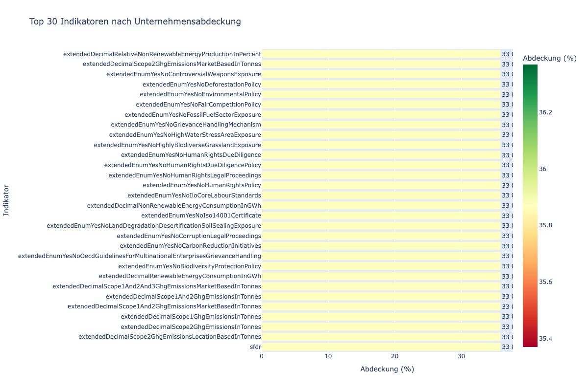

---

## 4. Querschnittsanalyse

### 4.1 Indikator-Unternehmens-Matrix

Die Heatmap-Visualisierung zeigt Clustering-Muster:
- Bestimmte Unternehmen berichten umfassend über viele Indikatoren
- Einige Indikatorgruppen tendieren dazu, zusammen zu erscheinen (Framework-Konformität)
- Klare Lücken, wo Unternehmen spezifische Indikatorkategorien fehlen

### 4.2 Dimensionsverteilung

Statistische Verteilung der Dimensionen pro Unternehmen:

|       |   Dimensionen pro Unternehmen |
|:------|------------------------------:|
| count |                        92     |
| mean  |                       134.989 |
| std   |                       186.437 |
| min   |                         0     |
| 25%   |                         0     |
| 50%   |                         0     |
| 75%   |                       384.25  |
| max   |                       452     |

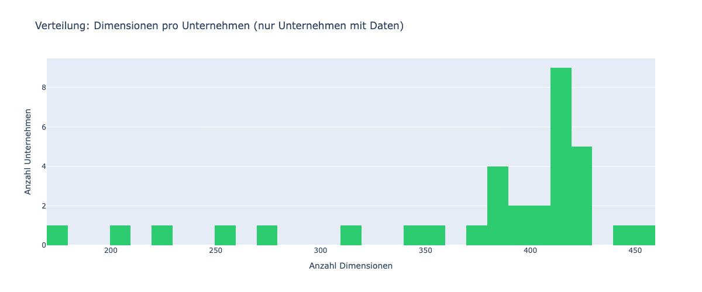

---

## 5. Vertiefung: Wichtige ESG-Kennzahlen

### 5.1 Kritische Nachhaltigkeitsindikatoren

Analyse der Verfügbarkeit der wichtigsten ESG-Kennzahlen:

| metric                        |   num_companies |   coverage_pct |
|:------------------------------|----------------:|---------------:|
| Scope 1 THG-Emissionen        |              33 |        35.8696 |
| Scope 2 THG-Emissionen        |              33 |        35.8696 |
| Scope 3 THG-Emissionen        |              33 |        35.8696 |
| Gesamt THG-Emissionen         |              33 |        35.8696 |
| Erneuerbare Energie           |              33 |        35.8696 |
| Wasserverbrauch               |              32 |        34.7826 |
| Geschlechtervielfalt Vorstand |              33 |        35.8696 |
| Unfallrate                    |              33 |        35.8696 |
| Kohlenstoffreduktion          |              33 |        35.8696 |
| Menschenrechtsrichtlinie      |              33 |        35.8696 |

**Analyse:**
- **THG-Emissionsdaten** (Scope 1, 2, 3) haben ähnliche Abdeckung (~35.9%)
- **Energieverbrauchs**-Metriken mäßig vertreten
- **Policy-Indikatoren** (Menschenrechte, Kohlenstoffreduktion) zeigen variierende Abdeckung
- Verfügbarkeit von **Vorstandsvielfalt** und **Unfallrate**-Daten variiert

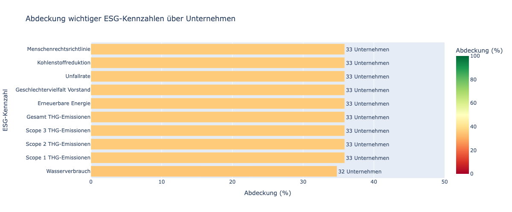

### 5.2 Umwelt-Kennzahlen - Top 10

| Indikator                                         |   Anzahl |
|:--------------------------------------------------|---------:|
| extendedEnumYesNoEnvironmentalPolicy              |       64 |
| extendedEnumYesNoCarbonReductionInitiatives       |       64 |
| extendedEnumYesNoWaterManagementPolicy            |       64 |
| extendedDecimalScope1GhgEmissionsInTonnes         |       64 |
| extendedEnumYesNoDeforestationPolicy              |       64 |
| extendedEnumYesNoBiodiversityProtectionPolicy     |       64 |
| extendedDecimalScope1And2GhgEmissionsInTonnes     |       64 |
| extendedDecimalScope2GhgEmissionsInTonnes         |       64 |
| extendedDecimalScope1And2And3GhgEmissionsInTonnes |       64 |
| extendedEnumYesNoHighWaterStressAreaExposure      |       64 |

### 5.3 Sozial-Kennzahlen - Top 10

| Indikator                                                    |   Anzahl |
|:-------------------------------------------------------------|---------:|
| extendedEnumYesNoIloCoreLabourStandards                      |       65 |
| extendedEnumYesNoReportedForcedOrCompulsoryLabourIncidents   |       64 |
| extendedEnumYesNoPolicyAgainstChildLabour                    |       64 |
| extendedEnumYesNoPolicyAgainstDiscriminationInTheWorkplace   |       64 |
| extendedDecimalBoardGenderDiversityBoardOfDirectorsInPercent |       64 |
| extendedEnumYesNoPolicyAgainstForcedLabour                   |       64 |
| extendedEnumYesNoWorkplaceAccidentPreventionPolicy           |       64 |
| extendedEnumYesNoReportedChildLabourIncidents                |       64 |
| extendedEnumYesNoTraffickingInHumanBeingsPolicy              |       64 |
| extendedDecimalBoardGenderDiversitySupervisoryBoardInPercent |       57 |

### 5.4 Governance-Kennzahlen - Top 10

| Indikator                                                  |   Anzahl |
|:-----------------------------------------------------------|---------:|
| extendedEnumYesNoUnGlobalCompactPrinciplesCompliancePolicy |       65 |
| extendedEnumYesNoCorruptionLegalProceedings                |       64 |
| extendedEnumYesNoHumanRightsDueDiligencePolicy             |       64 |
| extendedEnumYesNoWhistleblowerProtectionPolicy             |       64 |
| extendedEnumYesNoTransparencyDisclosurePolicy              |       64 |
| extendedEnumYesNoPolicyAgainstBriberyAndCorruption         |       64 |
| extendedEnumYesNoFairCompetitionPolicy                     |       64 |
| extendedEnumYesNoTechnologiesExpertiseTransferPolicy       |       64 |
| extendedEnumYesNoViolationOfTaxRulesAndRegulation          |       64 |
| extendedEnumYesNoHumanRightsPolicy                         |       64 |

---

## 6. Datenqualität & Lücken

### 6.1 Zusammenfassung der Datenabdeckung

| Kategorie | Status | Anzahl | Prozentsatz |
|-----------|--------|--------|-------------|
| ✅ Unternehmen mit vollständigen Daten (>400 dims) | Gut | 18 | 19.6% |
| 🟡 Unternehmen mit teilweisen Daten (1-400 dims) | Ausreichend | 15 | 16.3% |
| 🔴 Unternehmen ohne Daten (0 dims) | Schlecht | 59 | 64.1% |

### 6.2 Fehlende Datenmuster

**Primäre Lücke:** Die Mehrheit (64.1%) der Unternehmens-IDs haben null Datendimensionen.

**Mögliche Erklärungen:**
1. **Tochtergesellschaften** ohne unabhängige ESG-Berichterstattung
2. **Datenerfassung** noch nicht auf alle Entitäten ausgedehnt
3. **Framework-Nicht-Teilnahme** - Unternehmen berichten nicht unter SFDR/PCAF
4. **Kürzliche Ergänzungen** zur Dataland-Datenbank ohne Datenaufnahme

### 6.3 Indikatorlücken

**Indikatoren mit niedriger Abdeckung** (unteres Perzentil):

| indicator                                                                                                                                                                                                                        |   num_companies |   coverage_percentage |
|:---------------------------------------------------------------------------------------------------------------------------------------------------------------------------------------------------------------------------------|----------------:|----------------------:|
| extendedDecimalInsuranceReinsuranceBreakdownOfTheNumeratorOfTheKpiPerEnvironmentalObjectiveTurnoverBasedShareOfTurnoverBasedKpiSubstantiallyContributingToPollutionPreventionAndControlInPercentOfWhichEnabling                  |               1 |               1.08696 |
| extendedDecimalInsuranceReinsuranceBreakdownOfTheNumeratorOfTheKpiPerEnvironmentalObjectiveTurnoverBasedShareOfTurnoverBasedKpiSubstantiallyContributingToPollutionPreventionAndControlInPercentAligned                          |               1 |               1.08696 |
| extendedDecimalInsuranceReinsuranceBreakdownOfTheNumeratorOfTheKpiPerEnvironmentalObjectiveTurnoverBasedShareOfTurnoverBasedKpiSubstantiallyContributingToClimateChangeMitigationInPercentOfWhichTransitional                    |               1 |               1.08696 |
| extendedDecimalInsuranceReinsuranceBreakdownOfTheNumeratorOfTheKpiPerEnvironmentalObjectiveTurnoverBasedShareOfTurnoverBasedKpiSubstantiallyContributingToClimateChangeMitigationInPercentOfWhichEnabling                        |               1 |               1.08696 |
| extendedDecimalInsuranceReinsuranceBreakdownOfTheNumeratorOfTheKpiPerEnvironmentalObjectiveTurnoverBasedShareOfTurnoverBasedKpiSubstantiallyContributingToClimateChangeMitigationInPercentAligned                                |               1 |               1.08696 |
| extendedDecimalInsuranceReinsuranceBreakdownOfTheNumeratorOfTheKpiPerEnvironmentalObjectiveTurnoverBasedShareOfTurnoverBasedKpiSubstantiallyContributingToClimateChangeAdaptationInPercentOfWhichEnabling                        |               1 |               1.08696 |
| extendedDecimalInsuranceReinsuranceBreakdownOfTheNumeratorOfTheKpiPerEnvironmentalObjectiveTurnoverBasedShareOfTurnoverBasedKpiSubstantiallyContributingToClimateChangeAdaptationInPercentAligned                                |               1 |               1.08696 |
| extendedDecimalInsuranceReinsuranceBreakdownOfTheNumeratorOfTheKpiPerEnvironmentalObjectiveCapexBasedShareOfCapexBasedKpiSubstantiallyContributingToTransitionToACircularEconomyInPercentOfWhichEnabling                         |               1 |               1.08696 |
| extendedDecimalInsuranceReinsuranceBreakdownOfTheNumeratorOfTheKpiPerEnvironmentalObjectiveCapexBasedShareOfCapexBasedKpiSubstantiallyContributingToTransitionToACircularEconomyInPercentAligned                                 |               1 |               1.08696 |
| extendedDecimalInsuranceReinsuranceBreakdownOfTheNumeratorOfTheKpiPerEnvironmentalObjectiveCapexBasedShareOfCapexBasedKpiSubstantiallyContributingToSustainableUseAndProtectionOfWaterAndMarineResourcesInPercentOfWhichEnabling |               1 |               1.08696 |
| extendedDecimalInsuranceReinsuranceBreakdownOfTheNumeratorOfTheKpiPerEnvironmentalObjectiveCapexBasedShareOfCapexBasedKpiSubstantiallyContributingToProtectionAndRestorationOfBiodiversityAndEcosystemsInPercentOfWhichEnabling  |               1 |               1.08696 |
| extendedDecimalInsuranceReinsuranceBreakdownOfTheNumeratorOfTheKpiPerEnvironmentalObjectiveCapexBasedShareOfCapexBasedKpiSubstantiallyContributingToProtectionAndRestorationOfBiodiversityAndEcosystemsInPercentAligned          |               1 |               1.08696 |
| extendedDecimalInsuranceReinsuranceBreakdownOfTheNumeratorOfTheKpiPerEnvironmentalObjectiveCapexBasedShareOfCapexBasedKpiSubstantiallyContributingToPollutionPreventionAndControlInPercentOfWhichEnabling                        |               1 |               1.08696 |
| extendedDecimalInsuranceReinsuranceBreakdownOfTheNumeratorOfTheKpiPerEnvironmentalObjectiveCapexBasedShareOfCapexBasedKpiSubstantiallyContributingToPollutionPreventionAndControlInPercentAligned                                |               1 |               1.08696 |
| extendedDecimalInsuranceReinsuranceBreakdownOfTheNumeratorOfTheKpiPerEnvironmentalObjectiveCapexBasedShareOfCapexBasedKpiSubstantiallyContributingToClimateChangeMitigationInPercentOfWhichTransitional                          |               1 |               1.08696 |
| extendedDecimalInsuranceReinsuranceBreakdownOfTheNumeratorOfTheKpiPerEnvironmentalObjectiveCapexBasedShareOfCapexBasedKpiSubstantiallyContributingToClimateChangeMitigationInPercentOfWhichEnabling                              |               1 |               1.08696 |
| extendedDecimalInsuranceReinsuranceBreakdownOfTheNumeratorOfTheKpiPerEnvironmentalObjectiveCapexBasedShareOfCapexBasedKpiSubstantiallyContributingToClimateChangeMitigationInPercentAligned                                      |               1 |               1.08696 |
| extendedDecimalInsuranceReinsuranceBreakdownOfTheNumeratorOfTheKpiPerEnvironmentalObjectiveCapexBasedShareOfCapexBasedKpiSubstantiallyContributingToClimateChangeAdaptationInPercentOfWhichEnabling                              |               1 |               1.08696 |
| extendedDecimalInsuranceReinsuranceBreakdownOfTheNumeratorOfTheKpiPerEnvironmentalObjectiveCapexBasedShareOfCapexBasedKpiSubstantiallyContributingToClimateChangeAdaptationInPercentAligned                                      |               1 |               1.08696 |
| extendedDecimalInsuranceReinsuranceProportionOfAbsolutePremiumsOfTaxonomyAlignedActivities                                                                                                                                       |               1 |               1.08696 |

Diese seltenen Indikatoren können darstellen:
- Unternehmensspezifische oder branchenspezifische Metriken
- Neu eingeführte Berichtsanforderungen
- Optionale/fortgeschrittene ESG-Offenlegungen
- Laufende Datenerfassung

---

## 7. Empfehlungen

### 7.1 Für Datennutzer

1. **Fokus auf abgedeckte Unternehmen**: Priorisieren Sie die Analyse der 33 Unternehmen mit substanziellen Daten
2. **Framework-Ausrichtung**: SFDR- und PCAF-Frameworks zeigen stärkste Abdeckung
3. **Indikatorauswahl**: Verwenden Sie Top-Abdeckungs-Indikatoren für Unternehmensvergleiche
4. **Lücken beachten**: Seien Sie sich bewusst, dass 64% der IDs keine Daten haben; validieren Sie Entitätsrelevanz

### 7.2 Für Datenanbieter

1. **Tochtergesellschafts-Abdeckung erweitern**: Klären Sie, welche Entitäten unabhängige Berichterstattung haben sollten
2. **Frameworks standardisieren**: Arbeiten Sie auf universelle Adoption von SFDR/PCAF hin
3. **Indikatorlücken schließen**: Zielen Sie auf Metriken mit niedriger Abdeckung aber hoher Wichtigkeit (z.B. Vorstandsvielfalt, Wasserverbrauch)
4. **Datenqualitätsflags**: Unterscheiden Sie zwischen "nicht anwendbar" vs. "nicht berichtet" vs. "in Bearbeitung"

### 7.3 Prioritätsziele

**Unternehmen, die Datenerfassungsaufmerksamkeit benötigen:**
- Alle 59 Null-Dimensions-Entitäten (Relevanz validieren)
- Unternehmen unter 50% Vollständigkeitsschwelle

**Indikatoren, die breitere Adoption benötigen:**
- Geschlechtervielfalt im Vorstand (Governance)
- Wasserverbrauch (Umwelt)
- Unfallrate & Arbeitsplatzsicherheit (Soziales)
- Scope 3 THG-Emissionen (Umwelt)

---

## 8. Anhänge

### Anhang A: Top 100 Indikatoren nach Häufigkeit

| indicator                                                                   |   count |   percentage |
|:----------------------------------------------------------------------------|--------:|-------------:|
| plainEnumFiscalYearDeviation                                                |      66 |     0.531444 |
| extendedEnumYesNoControversialWeaponsExposure                               |      66 |     0.531444 |
| plainDateSfdrDataDate                                                       |      66 |     0.531444 |
| sfdr                                                                        |      66 |     0.531444 |
| plainDateFiscalYearEnd                                                      |      66 |     0.531444 |
| pcaf                                                                        |      66 |     0.531444 |
| extendedEnumYesNoHumanRightsDueDiligence                                    |      65 |     0.523392 |
| extendedEnumYesNoIloCoreLabourStandards                                     |      65 |     0.523392 |
| extendedEnumYesNoUnGlobalCompactPrinciplesCompliancePolicy                  |      65 |     0.523392 |
| extendedEnumYesNoCorruptionLegalProceedings                                 |      64 |     0.515339 |
| extendedEnumYesNoEnvironmentalPolicy                                        |      64 |     0.515339 |
| extendedEnumYesNoCarbonReductionInitiatives                                 |      64 |     0.515339 |
| extendedEnumYesNoHumanRightsDueDiligencePolicy                              |      64 |     0.515339 |
| extendedEnumYesNoWhistleblowerProtectionPolicy                              |      64 |     0.515339 |
| extendedEnumYesNoWaterManagementPolicy                                      |      64 |     0.515339 |
| extendedDecimalScope1GhgEmissionsInTonnes                                   |      64 |     0.515339 |
| extendedEnumYesNoManufactureOfAgrochemicalPesticidesProducts                |      64 |     0.515339 |
| extendedEnumYesNoPrimaryForestAndWoodedLandOfNativeSpeciesExposure          |      64 |     0.515339 |
| extendedEnumYesNoTransparencyDisclosurePolicy                               |      64 |     0.515339 |
| extendedEnumYesNoReportedForcedOrCompulsoryLabourIncidents                  |      64 |     0.515339 |
| extendedEnumYesNoPolicyAgainstChildLabour                                   |      64 |     0.515339 |
| extendedEnumYesNoDeforestationPolicy                                        |      64 |     0.515339 |
| extendedEnumYesNoPolicyAgainstDiscriminationInTheWorkplace                  |      64 |     0.515339 |
| extendedEnumYesNoIso14001Certificate                                        |      64 |     0.515339 |
| extendedEnumYesNoPolicyAgainstBriberyAndCorruption                          |      64 |     0.515339 |
| extendedEnumYesNoFairCompetitionPolicy                                      |      64 |     0.515339 |
| extendedEnumYesNoOecdGuidelinesForMultinationalEnterprisesGrievanceHandling |      64 |     0.515339 |
| extendedEnumYesNoGrievanceHandlingMechanism                                 |      64 |     0.515339 |
| extendedEnumYesNoHumanRightsLegalProceedings                                |      64 |     0.515339 |
| extendedEnumYesNoTechnologiesExpertiseTransferPolicy                        |      64 |     0.515339 |
| extendedEnumYesNoViolationOfTaxRulesAndRegulation                           |      64 |     0.515339 |
| extendedEnumYesNoBiodiversityProtectionPolicy                               |      64 |     0.515339 |
| extendedDecimalBoardGenderDiversityBoardOfDirectorsInPercent                |      64 |     0.515339 |
| extendedEnumYesNoPolicyAgainstForcedLabour                                  |      64 |     0.515339 |
| extendedEnumYesNoWorkplaceAccidentPreventionPolicy                          |      64 |     0.515339 |
| extendedEnumYesNoThreatenedSpeciesExposure                                  |      64 |     0.515339 |
| extendedEnumYesNoRareOrEndangeredEcosystemsExposure                         |      64 |     0.515339 |
| extendedDecimalScope1And2GhgEmissionsInTonnes                               |      64 |     0.515339 |
| extendedEnumYesNoReportedChildLabourIncidents                               |      64 |     0.515339 |
| extendedEnumYesNoTraffickingInHumanBeingsPolicy                             |      64 |     0.515339 |
| extendedEnumYesNoHumanRightsPolicy                                          |      64 |     0.515339 |
| extendedDecimalScope2GhgEmissionsInTonnes                                   |      64 |     0.515339 |
| extendedDecimalScope1And2And3GhgEmissionsInTonnes                           |      64 |     0.515339 |
| extendedEnumYesNoProtectedAreasExposure                                     |      64 |     0.515339 |
| extendedEnumYesNoSupplierCodeOfConduct                                      |      64 |     0.515339 |
| extendedEnumYesNoSustainableAgriculturePolicy                               |      64 |     0.515339 |
| extendedEnumYesNoHighWaterStressAreaExposure                                |      64 |     0.515339 |
| extendedEnumYesNoLandDegradationDesertificationSoilSealingExposure          |      64 |     0.515339 |
| extendedEnumYesNoSustainableOceansAndSeasPolicy                             |      64 |     0.515339 |
| extendedDecimalScope3GhgEmissionsInTonnes                                   |      63 |     0.507287 |
| extendedEnumYesNoFossilFuelSectorExposure                                   |      63 |     0.507287 |
| extendedDecimalTotalRevenueInEUR                                            |      63 |     0.507287 |
| extendedEnumFiscalYearDeviation                                             |      63 |     0.507287 |
| extendedDateFiscalYearEnd                                                   |      63 |     0.507287 |
| customEnumEuTaxonomyReportingAssurance                                      |      63 |     0.507287 |
| extendedEnumYesNoHighlyBiodiverseGrasslandExposure                          |      63 |     0.507287 |
| extendedIntegerMaleBoardMembersBoardOfDirectors                             |      62 |     0.499235 |
| extendedDecimalGhgIntensityScope2InTonnesPerMillionEURRevenue               |      62 |     0.499235 |
| extendedDecimalGhgIntensityScope1InTonnesPerMillionEURRevenue               |      62 |     0.499235 |
| extendedDecimalScope1And2GhgEmissionsMarketBasedInTonnes                    |      62 |     0.499235 |
| extendedDecimalRenewableEnergyConsumptionInGWh                              |      62 |     0.499235 |
| extendedEnumYesNoIsNfrdMandatory                                            |      62 |     0.499235 |
| extendedDecimalScope2GhgEmissionsMarketBasedInTonnes                        |      62 |     0.499235 |
| extendedDecimalScope2GhgEmissionsLocationBasedInTonnes                      |      62 |     0.499235 |
| extendedDecimalRelativeNonRenewableEnergyConsumptionInPercent               |      62 |     0.499235 |
| extendedIntegerFemaleBoardMembersBoardOfDirectors                           |      62 |     0.499235 |
| extendedDecimalGhgIntensityScope3InTonnesPerMillionEURRevenue               |      61 |     0.491183 |
| extendedDecimalScope1And2GhgEmissionsLocationBasedInTonnes                  |      61 |     0.491183 |
| extendedDecimalGhgIntensityInTonnesPerMillionEURRevenue                     |      61 |     0.491183 |
| extendedDecimalScope1And2And3GhgEmissionsMarketBasedInTonnes                |      61 |     0.491183 |
| extendedDecimalScope1And2And3GhgEmissionsLocationBasedInTonnes              |      60 |     0.483131 |
| extendedDecimalNonRenewableEnergyConsumptionInGWh                           |      60 |     0.483131 |
| extendedDecimalHazardousAndRadioactiveWasteInTonnes                         |      60 |     0.483131 |
| extendedDecimalRelativeNonRenewableEnergyProductionInPercent                |      59 |     0.475079 |
| extendedDecimalNonRecycledWasteInTonnes                                     |      59 |     0.475079 |
| eutaxonomy-non-financials                                                   |      58 |     0.467026 |
| extendedCurrencyCapexEligibleShareAbsoluteShare                             |      58 |     0.467026 |
| extendedDecimalRelativeWaterUsageInCubicMetersPerMillionEURRevenue          |      58 |     0.467026 |
| extendedDecimalOpexEligibleShareRelativeShareInPercent                      |      58 |     0.467026 |
| extendedCurrencyOpexEligibleShareAbsoluteShare                              |      58 |     0.467026 |
| extendedCurrencyTotalAmount                                                 |      58 |     0.467026 |
| extendedDecimalRevenueEligibleShareRelativeShareInPercent                   |      58 |     0.467026 |
| extendedDecimalNonRenewableEnergyConsumptionFossilFuelsInGWh                |      58 |     0.467026 |
| extendedCurrencyRevenueEligibleShareAbsoluteShare                           |      58 |     0.467026 |
| extendedDecimalCapexEligibleShareRelativeShareInPercent                     |      58 |     0.467026 |
| extendedDecimalWaterConsumptionInCubicMeters                                |      58 |     0.467026 |
| extendedCurrencyOpexTotalAmount                                             |      57 |     0.458974 |
| extendedEnumYesNoEuTaxonomyActivityLevelReporting                           |      57 |     0.458974 |
| extendedCurrencyCapexTotalAmount                                            |      57 |     0.458974 |
| extendedDecimalNonRenewableEnergyConsumptionCrudeOilInGWh                   |      57 |     0.458974 |
| extendedDecimalNonRenewableEnergyConsumptionNaturalGasInGWh                 |      57 |     0.458974 |
| extendedDecimalBoardGenderDiversitySupervisoryBoardInPercent                |      57 |     0.458974 |
| extendedIntegerMaleBoardMembersSupervisoryBoard                             |      57 |     0.458974 |
| extendedDecimalRateOfAccidents                                              |      57 |     0.458974 |
| extendedEnumYesNoFairBusinessMarketingAdvertisingPolicy                     |      56 |     0.450922 |
| extendedDecimalScope3UpstreamGhgEmissionsInTonnes                           |      56 |     0.450922 |
| extendedDecimalRevenueAlignedShareRelativeShareInPercent                    |      56 |     0.450922 |
| extendedEnumYesNoNaScopeOfEntities                                          |      56 |     0.450922 |
| extendedDecimalEmissionsToWaterInTonnes                                     |      56 |     0.450922 |
| extendedDecimalNonRenewableEnergyConsumptionOtherInGWh                      |      56 |     0.450922 |

### Anhang B: Unternehmensübersicht

Vollständige Auflistung aller Unternehmen mit Dimensionszahlen:

| company_id                           | company_name                                                                                            | dax_name                             |   num_dimensions | success   |   completeness_score |
|:-------------------------------------|:--------------------------------------------------------------------------------------------------------|:-------------------------------------|-----------------:|:----------|---------------------:|
| 9081abb0-094f-41fa-b6ee-b7a47e3fe390 | Daimler Truck Holding AG                                                                                | Daimler Truck Holding AG             |              452 | True      |               100    |
| 17ddbb60-1348-47e1-9c56-6dc6c5fdf4c9 | E.ON SE                                                                                                 | E.ON SE                              |              447 | True      |                98.89 |
| 4db3fb50-0540-432f-ad0f-f41848608a8d | Deutsche Börse Aktiengesellschaft                                                                       | Deutsche Börse AG                    |              429 | True      |                94.91 |
| 10075779-5ce0-4e38-961f-4b350d3be287 | BASF SE                                                                                                 | BASF SE                              |              428 | True      |                94.69 |
| e716b566-c308-45c6-88be-b4d317a4fe93 | AIRBUS SE                                                                                               | Airbus SE                            |              425 | True      |                94.03 |
| 39260625-315b-4158-97aa-64b69eb331db | Siemens Energy AG                                                                                       | Siemens Energy AG                    |              423 | True      |                93.58 |
| f16a12ff-714c-4dd1-b141-eb8b0355c833 | Siemens Aktiengesellschaft                                                                              | Siemens AG                           |              421 | True      |                93.14 |
| 2692c784-7a0a-4549-8c13-d3c8ebf7a639 | Vonovia SE                                                                                              | Vonovia SE                           |              419 | True      |                92.7  |
| 144d3018-7c10-4500-ab49-80e6e2a28060 | MTU Aero Engines AG                                                                                     | MTU Aero Engines AG                  |              419 | True      |                92.7  |
| d8e7e3af-50d2-4aa0-93d0-6e94a73e67d6 | BRENNTAG SE                                                                                             | Brenntag SE                          |              417 | True      |                92.26 |
| 2e807990-9056-4db4-9d95-2e6b2f39f88f | DEUTSCHE TELEKOM AG                                                                                     | Deutsche Telekom AG                  |              416 | True      |                92.04 |
| 67450485-5e35-4403-a740-c7f9984859ed | Infineon Technologies AG                                                                                | Infineon Technologies AG             |              415 | True      |                91.81 |
| 48dc8d2d-96c7-48a6-a2a8-9638f2b38ca6 | Bayer Aktiengesellschaft                                                                                | Bayer AG                             |              415 | True      |                91.81 |
| b8e4cd35-5732-4704-bf09-d8e8256412a3 | Fresenius Medical Care AG                                                                               | Fresenius Medical Care AG & Co. KGaA |              414 | True      |                91.59 |
| e7a6f3cb-118f-4939-b39a-48e48047d028 | Fresenius SE & Co. KGaA                                                                                 | Fresenius SE & Co. KGaA              |              413 | True      |                91.37 |
| 7fa7c907-3aad-4cb8-9fbe-c8f3643fc5cc | Symrise AG                                                                                              | Symrise AG                           |              413 | True      |                91.37 |
| 968892e9-9670-4292-a4bc-a86df0855333 | MERCK Kommanditgesellschaft auf Aktien                                                                  | Merck KGaA                           |              404 | True      |                89.38 |
| cc0bf7a2-c92d-48dc-bfb2-efba2670246a | Sartorius Aktiengesellschaft                                                                            | Sartorius AG                         |              403 | True      |                89.16 |
| 5695dc34-3ed8-4aaf-8475-25b7f4c7ae4d | Rheinmetall Aktiengesellschaft                                                                          | Rheinmetall AG                       |              391 | True      |                86.5  |
| 6fe8a4a4-ba7d-4883-95e6-0b9d69ee758f | Heidelberg Materials AG                                                                                 | Heidelberg Materials AG              |              391 | True      |                86.5  |
| ca4db94b-8b41-4899-9e44-bb4ee1c66318 | Mercedes-Benz Group AG                                                                                  | Mercedes-Benz Group AG               |              389 | True      |                86.06 |
| 5c01af7c-6de0-48ce-9adc-070cb3c4075b | Continental Aktiengesellschaft                                                                          | Continental AG                       |              387 | True      |                85.62 |
| 30004cba-dfe1-4aeb-a67b-2cc4001d0b02 | SAP SE                                                                                                  | SAP SE                               |              385 | True      |                85.18 |
| 2256469e-1386-4783-8b66-bfe849615236 | COMMERZBANK Aktiengesellschaft                                                                          | Commerzbank AG                       |              384 | True      |                84.96 |
| e9710cb1-0cad-4415-bc8a-e77ed35588ed | Zalando SE                                                                                              | Zalando SE                           |              379 | True      |                83.85 |
| 5b652bd7-5660-4fdd-a558-237587fc18a4 | DEUTSCHE BANK AKTIENGESELLSCHAFT                                                                        | Deutsche Bank AG                     |              359 | True      |                79.42 |
| 4fdfb860-855e-4a08-81a0-129bd172dc1e | Allianz SE                                                                                              | Allianz SE                           |              347 | True      |                76.77 |
| 380b3111-bf97-4bae-9bf9-3e9bed9f35f1 | Henkel AG & Co. KGaA                                                                                    | Henkel AG & Co. KGaA                 |              312 | True      |                69.03 |
| 04dce05d-09d5-4d2b-98f7-4e64ad9a3e39 | Deutsche Post AG                                                                                        | Deutsche Post AG                     |              271 | True      |                59.96 |
| b74fe176-8886-4127-aa88-a45a32c386ac | adidas AG                                                                                               | Adidas AG                            |              253 | True      |                55.97 |
| cb57b6f0-8523-4c74-9dde-ff20e727a55c | Siemens Healthineers AG                                                                                 | Siemens Healthineers AG              |              222 | True      |                49.12 |
| be2762d6-232d-4239-95ae-88ce6096c884 | QIAGEN N.V.                                                                                             | QIAGEN N.V.                          |              203 | True      |                44.91 |
| b3070cf5-4618-4a42-9979-8f34c041f5ac | Porsche Automobil Holding SE                                                                            | Porsche Automobil Holding SE         |              173 | True      |                38.27 |
| c2d2a777-e4dc-4e20-b987-1b6b2b444492 | HSBC PORTFÖY ALLİANZ SERBEST ÖZEL FON                                                                   | Allianz SE                           |                0 | True      |                 0    |
| 8e49587b-43ca-4dac-80f7-9c37fa22664b | KARTHIKA                                                                                                | SAP SE                               |                0 | True      |                 0    |
| a8731ee3-8263-49e7-9032-82f18e9637eb | Allianz Selection Diversified Aggressive Growth Fund                                                    | Allianz SE                           |                0 | True      |                 0    |
| b2872f82-beb5-4030-ad70-53bb3d22257e | Allianz Selection Alternative                                                                           | Allianz SE                           |                0 | True      |                 0    |
| 66d7335d-c03b-43be-a237-dcf9b3f10768 | ALLIANZ SELECTION                                                                                       | Allianz SE                           |                0 | True      |                 0    |
| 1914d0c6-2c88-490f-b140-1403bcfb9bc4 | Allianz Select Income and Growth                                                                        | Allianz SE                           |                0 | True      |                 0    |
| 76f730bd-0a86-43eb-8a04-3e4668341c76 | ALLIANZ SEGUROS SA                                                                                      | Allianz SE                           |                0 | True      |                 0    |
| 5cd4ba46-d895-4028-b236-3bf6700d6a36 | ALLIANZ SEGUROS S/A                                                                                     | Allianz SE                           |                0 | True      |                 0    |
| 794f9bae-28cc-4d1b-8010-e46004621663 | Allianz Seguros de Vida SA                                                                              | Allianz SE                           |                0 | True      |                 0    |
| 54f46b89-82f8-44b2-a003-d4b716ebaa44 | SAP SE ADRhedged                                                                                        | SAP SE                               |                0 | True      |                 0    |
| fd1746b5-2856-4359-9a1b-a930a1b6767a | SAP SEMI PRIVATE LIMITED                                                                                | SAP SE                               |                0 | True      |                 0    |
| 3c6792ff-6481-4040-87b5-fa6093485ee7 | SAP Services s.r.o.                                                                                     | SAP SE                               |                0 | True      |                 0    |
| 7a57e0dd-8458-4ad2-be7f-e3e4fbf2673a | SAP SERVO mehanični obrati d.d.                                                                         | SAP SE                               |                0 | True      |                 0    |
| 26daf055-d10e-4a1a-a8c9-17b56346417c | ASAP SEASIDE HOTEL LLC                                                                                  | SAP SE                               |                0 | True      |                 0    |
| c3942298-8a11-4733-831e-7c1f73cb40b0 | SAS ALLIANZ SERBIE                                                                                      | Allianz SE                           |                0 | True      |                 0    |
| 0534bc86-facc-4bf1-a1e6-f5beae296c20 | ASAP SERVICES                                                                                           | SAP SE                               |                0 | True      |                 0    |
| 48cfb72e-9349-4634-b551-b87464e2e4d7 | ASAP SERVICES S.R.L.                                                                                    | SAP SE                               |                0 | True      |                 0    |
| c268dafe-4617-412d-93fb-e17f5ee4cf71 | ASSAP SERVIZI SRL                                                                                       | SAP SE                               |                0 | True      |                 0    |
| fcea9cb7-5e13-421c-938b-5af76761fb3e | MARSAP SERVICES PRIVATE LIMITED                                                                         | SAP SE                               |                0 | True      |                 0    |
| 06348e46-eb89-4165-a240-d3d299c64fb9 | NORTH KITSAP SELF STORAGE, INC.                                                                         | SAP SE                               |                0 | True      |                 0    |
| 8dd23baa-3f25-40bd-b245-9653656daf56 | Allianz Securite                                                                                        | Allianz SE                           |                0 | True      |                 0    |
| 8de38778-fe02-43d4-8ec1-773d78fb1318 | Allianz Securicash SRI                                                                                  | Allianz SE                           |                0 | True      |                 0    |
| 35e67e24-1ab0-4788-96ce-e352f4fe5293 | Verein von Belegschaftsaktionären in der Siemens AG, e.V. München                                       | Siemens AG                           |                0 | True      |                 0    |
| 5243c4a8-bd2a-4a52-9001-f9316c208cb9 | ALLIANZ SECTEUR EURO IMMOBILIER                                                                         | Allianz SE                           |                0 | True      |                 0    |
| a125dbf5-8577-4466-aa64-9dc210ce1ad8 | Siemens Energy AG                                                                                       | Siemens Energy AG                    |                0 | True      |                 0    |
| 8ab211df-38e7-4263-9aa4-967f81c867a7 | Allianz SE Ashmore Emerging Markets Corporates Fund                                                     | Allianz SE                           |                0 | True      |                 0    |
| 29243f6f-50ab-4d78-bc3a-c810e913599f | AIRBUS SECURE LAND COMMUNICATIONS GMBH                                                                  | Airbus SE                            |                0 | True      |                 0    |
| a91162e9-3558-499a-8763-ddbc7eb230da | Erholungswerk der Belegschaft der Heidelberg Materials AG e.V.                                          | Heidelberg Materials AG              |                0 | True      |                 0    |
| 34cf901c-e757-483b-9727-c187e0320046 | Allianz Selection Diversified Conservative Fund                                                         | Allianz SE                           |                0 | True      |                 0    |
| 9d2bfc8c-249f-4cbb-8d1c-7191a69a384e | Allianz Selection Diversified Stable Growth Fund                                                        | Allianz SE                           |                0 | True      |                 0    |
| 02b26da6-e3e5-4acf-9481-a4c7a017aea2 | Allianz Selection Fixed Income                                                                          | Allianz SE                           |                0 | True      |                 0    |
| ac7d2c63-fccc-404d-be74-f9c7663f82dc | BBVA ALLIANZ SEGUROS Y REASEGUROS, S.A.                                                                 | Allianz SE                           |                0 | True      |                 0    |
| 78e08745-33b8-4217-9382-287b2c477c0f | BASF SERVICES AMERICAS S.R.L.                                                                           | BASF SE                              |                0 | True      |                 0    |
| 6f444396-2e71-40c1-8101-780ef1ba0c4e | BASF Services Europe GmbH                                                                               | BASF SE                              |                0 | True      |                 0    |
| 70208d6e-237b-40bf-bc9a-ff725800f16e | Allianz Thematic Income                                                                                 | Allianz SE                           |                0 | True      |                 0    |
| bc7e75c6-0bce-4878-9e0c-1382b10e1644 | Bayer Agriculture                                                                                       | Bayer AG                             |                0 | True      |                 0    |
| 92b4241e-60f5-4eaf-b1d7-35e90797c365 | Bayer Agriculture Pension Fund Belgium                                                                  | Bayer AG                             |                0 | True      |                 0    |
| 62dad5a4-0bdc-46a5-947d-ed82ff98a2c7 | VEREIN DER JUBILARE DER BAYER AG e.V.                                                                   | Bayer AG                             |                0 | True      |                 0    |
| c39b9a7a-36c8-47f6-925f-6dad7ef69835 | Beiersdorf AG                                                                                           | Beiersdorf AG                        |                0 | True      |                 0    |
| c326db3d-b8d7-435b-83c3-77cb7d8936ed | Allianz Paraplufonds N.V. - Allianz Selectie Fonds                                                      | Allianz SE                           |                0 | True      |                 0    |
| be781584-2a69-498a-8270-3467f21a9bf7 | ALLIANZ SERVIZI SOCIETA' PER AZIONI                                                                     | Allianz SE                           |                0 | True      |                 0    |
| 8302b6d2-fd44-45af-8d41-1f9d479259d3 | Commerzbank AG Shanghai Branch                                                                          | Commerzbank AG                       |                0 | True      |                 0    |
| 4f68a8f6-fe55-4b7d-82e0-79eba16cf86f | ALLIANZ SERVICES UK                                                                                     | Allianz SE                           |                0 | True      |                 0    |
| 2c2546a8-7736-4d33-8cdb-bc637f5a1b7e | CONTINENTAL AG ACQUISITIONS, LLC                                                                        | Continental AG                       |                0 | True      |                 0    |
| 336e5fd2-b538-4375-85a9-34351a19babc | CONTINENTAL AG OFFICE, LLC                                                                              | Continental AG                       |                0 | True      |                 0    |
| 2852acb0-9e5f-4e4f-8c4d-b7ab8cd00ddc | ALLIANZ SERVICES PRIVATE LIMITED                                                                        | Allianz SE                           |                0 | True      |                 0    |
| f3f9f2bb-e954-44d7-b5a5-fa060548e132 | M/S CONTINENTAL AGRO SEEDS                                                                              | Continental AG                       |                0 | True      |                 0    |
| 67113a61-4824-4632-8cf2-34e51bfba8e5 | Allianz Services Mauritius                                                                              | Allianz SE                           |                0 | True      |                 0    |
| 4fcd89b9-bda2-469c-ab65-044ea086a81e | Allianz SE-PD Fonds                                                                                     | Allianz SE                           |                0 | True      |                 0    |
| 5323cf58-6311-4b1f-b825-c78514965984 | Deutsche Bank AG Riyadh Branch                                                                          | Deutsche Bank AG                     |                0 | True      |                 0    |
| f302a16c-bccc-4077-843a-6eaae295a987 | DEUTSCHE BANK AG UK EXECUTIVE FUND TRACKER RETIREMENT PLAN                                              | Deutsche Bank AG                     |                0 | True      |                 0    |
| 3f18c576-a591-4521-8f6e-9b7e2890e892 | Jubiäums-Stiftung der Deutsche Bank AG Filiale München zugunsten des Lenbachhauses in München           | Deutsche Bank AG                     |                0 | True      |                 0    |
| 98cd35fc-5057-4a52-a835-e07a0402bef5 | Jubiläums-Stiftung der Deutsche Bank AG Filiale München zugunsten des Projekts "Zu Hause gesund werden" | Deutsche Bank AG                     |                0 | True      |                 0    |
| 89e576c1-a3b7-472f-ba17-b1e79f92e11d | ALLIANZ SENIOR EUROPEAN INFRASTRUCTURE DEBT FUND, SCSp, SICAV-RAIF                                      | Allianz SE                           |                0 | True      |                 0    |
| 5117256d-6f7a-4a68-ac7a-fabce375524b | Allianz Selective Global High Income                                                                    | Allianz SE                           |                0 | True      |                 0    |
| c8bc2865-3d62-4970-b803-06ebf1e9eba9 | Allianz Selection Small and Mid Cap Equity                                                              | Allianz SE                           |                0 | True      |                 0    |
| 01a2fd10-ecb6-40d0-aa4d-11ce8560a964 | Allianz Selection Income and Growth Fund                                                                | Allianz SE                           |                0 | True      |                 0    |
| d4783b26-acff-4905-8d22-275a3df9920d | E.ON Servicii Tehnice SRL                                                                               | E.ON SE                              |                0 | True      |                 0    |
| c041343e-a892-4950-be81-d5695fcc5ef6 | CONTINENTAL AGRA INTERNATIONAL FOODS INC.                                                               | Continental AG                       |                0 | True      |                 0    |

### Anhang C: Interaktive Visualisierungen

Alle Visualisierungen sind im Ausgabeverzeichnis verfügbar:

- Verteilung der Unternehmens-IDs (PNG)
- Top-Unternehmen nach Dimensionen (PNG)
- Top-Indikatoren (PNG)
- Top-Indikatoren nach Abdeckung (PNG)
- Verteilung der Indikatorabdeckung (PNG)
- Indikator-Unternehmens-Heatmap (PNG)
- Indikator-Kategorie-Aufschlüsselung (PNG)
- Datenvollständigkeits-Scores (PNG)
- ESG-Kategorieverteilung (PNG)
- Abdeckung wichtiger ESG-Kennzahlen (PNG)
- Unternehmen ohne Daten (PNG)
- Abdeckungs-Perzentil-Boxplot (PNG)

*Interaktive HTML-Versionen sind ebenfalls verfügbar für detaillierte Exploration.*

### Anhang D: Datenwörterbuch

**Schlüsselbegriffe:**

- **Unternehmens-ID**: Eindeutige Kennung im Dataland-System für eine juristische Person
- **Dimension**: Ein einzelner Datenpunkt (Indikator + Unternehmen + Zeitraum)
- **Indikator**: Eine spezifische ESG-Kennzahl oder Datenfeldtyp
- **Abdeckung**: Prozentsatz der Unternehmen, die einen bestimmten Indikator berichten
- **Framework**: Standardisiertes Berichtsschema (SFDR, PCAF, etc.)

**ESG-Kategorien:**
- **Umwelt**: Klima, Energie, Wasser, Abfall, Biodiversität
- **Soziales**: Arbeitsrechte, Menschenrechte, Gesundheit & Sicherheit, Vielfalt
- **Governance**: Anti-Korruption, Vorstandsstruktur, Transparenz, Compliance

---

## Fazit

Diese umfassende Analyse der Verfügbarkeit von DAX 40 ESG-Daten über die Dataland API offenbart eine Landschaft, die charakterisiert ist durch:

1. **Substanzielle Daten für Kernunternehmen**: 33 Entitäten liefern ESG-Daten
2. **Fragmentierte Abdeckung**: Keine universellen Indikatoren; maximale Abdeckung ~36%
3. **Framework-Konzentration**: SFDR- und PCAF-Frameworks dominant
4. **Signifikante Lücken**: 64% der Unternehmens-IDs fehlen Daten (hauptsächlich Tochtergesellschaften)
5. **Policy-lastige Berichterstattung**: Ja/Nein-Policy-Indikatoren überwiegen quantitative Metriken

**Der Weg nach vorn** erfordert Standardisierung, breitere Framework-Adoption und Klärung der Berichtsverantwortlichkeiten über Unternehmensstrukturen hinweg.

---

**Bericht erstellt:** 16.11.2025 00:05:16  
**Quell-Notebook:** `dax_40_report_generator.ipynb`  
**Datenverzeichnis:** `dax_40_analysis_output/`  

---
