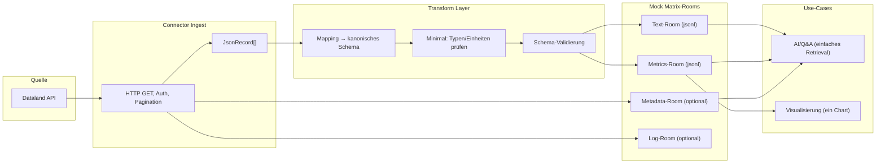
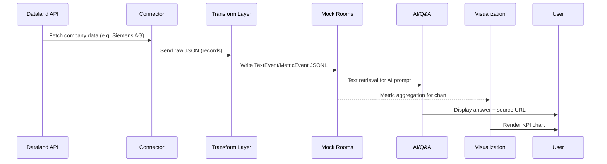

# MVP-Pipeline: Dataland → Transform → (Mock) Matrix-Rooms → AI & Visualisierung

## 0) Einleitung & Zielbild

**Projektidee:**  
Wir bauen eine wiederverwendbare Daten-Pipeline, die Nachhaltigkeits- und Unternehmensdaten aus **HTTP-APIs** (MVP: **Dataland**) einsammelt, **einheitlich** übersetzt und als **Events** in **Matrix-Rooms** bereitstellt. Darauf aufbauend entstehen zwei Produktfäden:
1) **AI-Nutzung** (Fragen beantworten mit Quellenbezug)  
2) **Visualisierung** (Charts/KPIs)

**MVP-Scope (Durchstich):**
- **eine Quelle** (Dataland API)  
- **ein Unternehmen** (z. B. „Siemens AG“)  
- **ein Notebook**, das alle Schritte der Pipeline **linear demonstriert**  
- **Transform minimal**: nur Feld-Mapping ins vereinbarte Schema  
- **Persistenz als Mock-Rooms** (lokale JSONL/Parquet)  
- **1 einfache Visualisierung** aus dem Metrics-Room  
- **1 einfacher AI-Use-Case** aus dem Text-Room (Keyword-/Passagen-Retrieval)

**Zielprodukt (Ausblick):**  
Eine Anwendung mit:
- Dropdown **Unternehmen**  
- vordefinierte **Fragen** („Umsatz 2025?“, „XYZ-KPI?“)  
- vordefinierte **Visualisierungen**  
- optional **eigener Prompt**

---

## 1 Architektur (Dataland MVP)



---

## 1.1 Sequence Diagram – Datenfluss im MVP



---

## 2) Notebook-Ablauf (Kapitelstruktur)

1. **Setup & Config**
2. **Connector (Dataland)**
3. **Transform (Minimal)**
4. **AI-Use-Case (leicht)**
5. **Visualisierung (ein Chart)**
6. **Abschluss & Ausblick**

---

## 3) Kanonische Event-Schemas (MVP)

**MetricEvent**
```json
{
  "type": "com.sus.metric",
  "event_id": "uuid-4",
  "ts": "2025-11-04T12:00:00Z",
  "content": {
    "company": "Siemens AG",
    "indicator": "CO2_Scope1",
    "value": 1.24,
    "unit": "Mt",
    "period": "2023",
    "source": "Dataland",
    "source_url": "https://dataland.com/..."
  }
}
```

**TextEvent**
```json
{
  "type": "com.sus.text",
  "event_id": "uuid-4",
  "ts": "2025-11-04T12:01:00Z",
  "content": {
    "company": "Siemens AG",
    "year": 2023,
    "section": "Klimastrategie",
    "text": "Siemens berichtet ...",
    "source": "Dataland",
    "source_url": "https://dataland.com/..."
  }
}
```

---

## 4) Mock-Rooms

- `rooms/text.jsonl`  
- `rooms/metrics.jsonl`  
- `rooms/log.jsonl`

Jede Zeile = ein Event.  
JSONL-Append per Helper-Funktion im Notebook.

---

## 5) Aufgabenverteilung

| Rolle | Aufgaben |
|------|-----------|
| Connector | Dataland anbinden |
| Transform | Mapping & Validation |
| Rooms/IO | JSONL-Handling |
| AI | Keyword Retrieval |
| Visualization | Einfaches Chart |
| PM | Demo, Akzeptanzkriterien |

---

## 6) Roadmap zum Produkt

1. Mehr Quellen / Firmen  
2. Reiferer Transform Layer  
3. Echte Matrix-Integration  
4. RAG / LLM für KI  
5. Dashboards & Reports  
6. Governance & Compute-Worker
